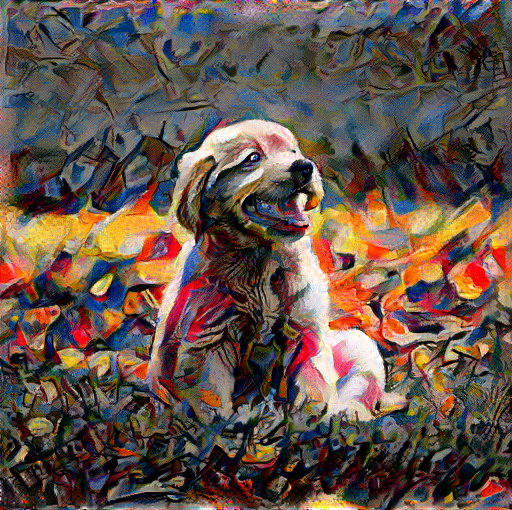

# Sequence Stylizers

Hi! Computing power is expensive and as a result we cannot host a server to do this. BUT - we can tell you how to use our application locally :)

This is a partial implementation of Ruder et al.'s paper [*Artistic style transfer for videos*](https://arxiv.org/pdf/1604.08610.pdf) for a CS1430 final project! The project consists of a Nextjs-based webapp that lets users upload a base video and a style image and which are then run through a python script that outputs the stylized version of their video for the user to download.

## Installation

1. First clone this project to your local machine
2. Set up a ```conda``` environment called cs1430 initialized with ```python``` version >= 3.9. Make sure you have the following dependencies installed

    - ```numpy```
    - ```opencv-contrib-python```
    - ```tensorflow```
    - ```Pillow```
    - ```ffmpeg-python```
    - ```shutil```

3. Also make sure you have ```ffmpeg``` installed on your machine.
4. Open the folder in your terminal and ```cd``` into ```sequence-stylizers```
5. Deactivate any active conda environments with ```conda deactivate```
6. Run ```npm install``` to install all the necessary npm packages
7. Lastly run ```npm run dev``` to get a version hosted locally on your machine

## Tweaking

Changing some of the values in the ```sequence-stylizer/src/utils/scripts/constants.py``` file can lead to very different results. The current values are some sensible defaults we found, but we encourage you to play around and see what different kinds of videos you can make!

## Conclusion

Thanks for checking out this project! We hope you had fun making some pretty stylized images and videos.


